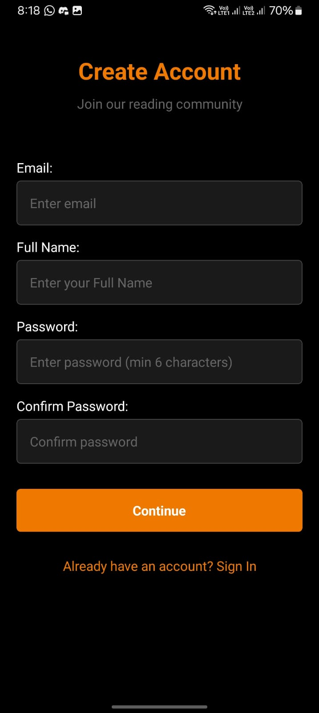
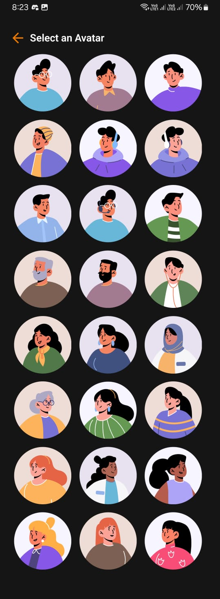
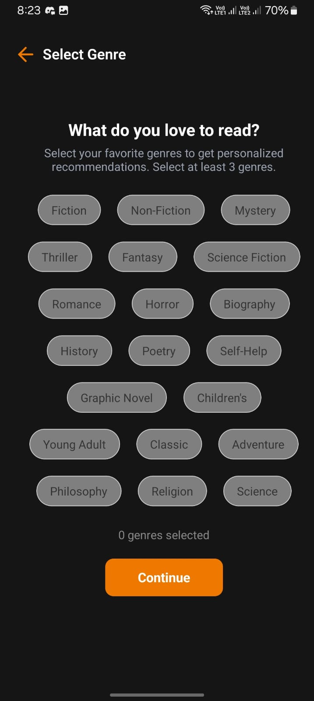
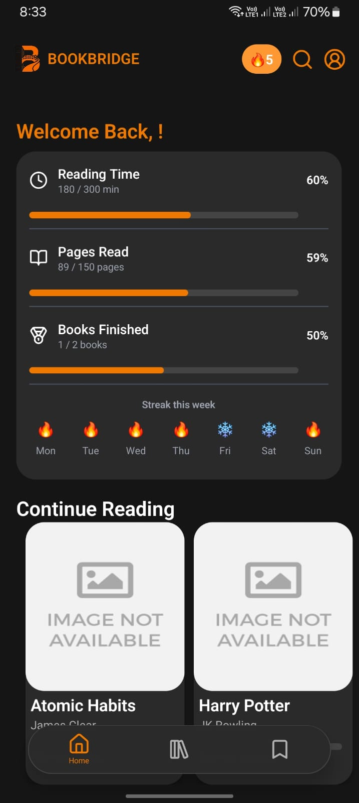
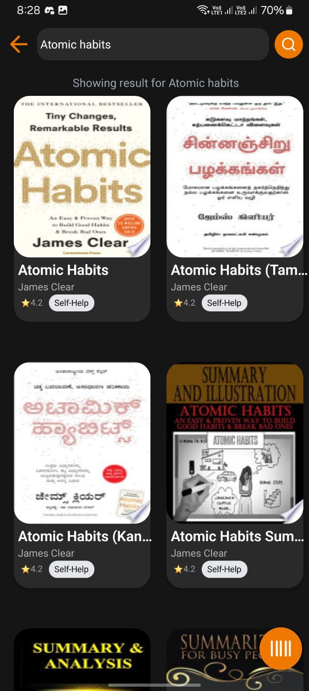
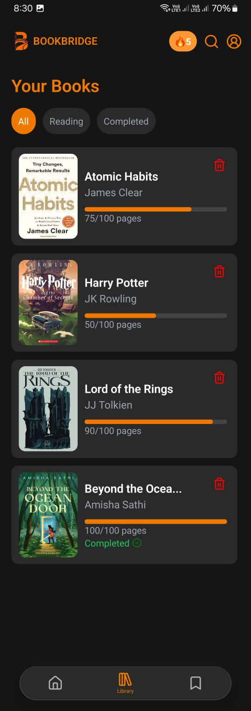
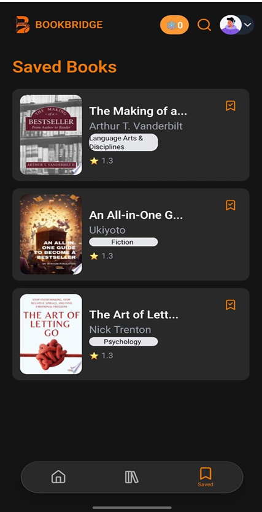
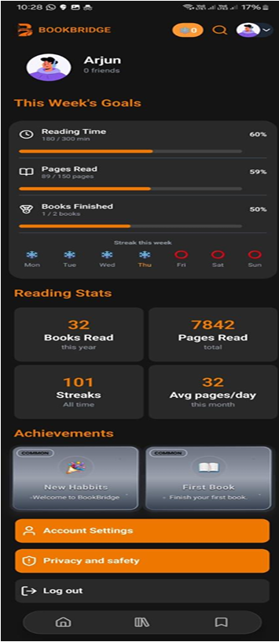
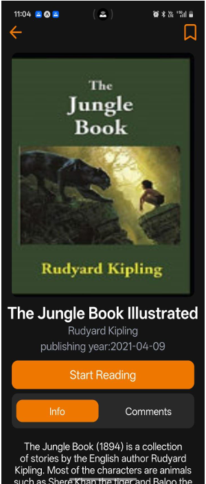

## BookBridge

Mobile-first reading companion that blends personalized tracking, social engagement, and AI-assisted recommendations so readers can set goals, stay motivated, and resume across devices with real-time progress sync.

### Key Features
- Personalized library: store PDFs in Supabase Storage with rich metadata (title, author, publisher, pages, genres, tags).
- Goal & streaks: daily/weekly targets with interactive streak calendar and progress stats.
- Social layer: follow/friend flow, activity feed, comments, and sharing.
- Reader experience: page-by-page PDF rendering with last-page resume across devices.
- Insights & recommendations: analytics on pace/genres plus ML-based book suggestions.
- Notifications: reminders, achievements, friend requests, and goal progress.

### System Modules
- Authentication (Supabase Auth)
- Book management (metadata + storage)
- Reader (PDF rendering + resume state)
- Analytics (reading time, pages, stats)
- Connections & comments (social)
- Notifications (reminders, achievements)
- Recommendation (ML-driven suggestions)
- Storage (upload/retrieve PDFs, covers)

### Tech Stack

| Layer          | Technology                          | Purpose                                           |
|---------------|--------------------------------------|---------------------------------------------------|
| Frontend      | React Native (Expo), Tailwind/NativeWind | Cross-platform UI and styling for mobile app  |
| Backend (BaaS)| Supabase                             | Auth, real-time database, and file storage        |
| Database      | PostgreSQL (via Supabase)            | Relational data storage for app entities          |
| Language      | JavaScript / TypeScript              | Core application and business logic               |
| Testing       | Jest, Expo Testing Library           | Unit and component testing                        |
| Deployment    | Expo EAS Build                       | Building and distributing production mobile apps  |

### Screens (sample)

  
  
  

 

  
  
  

 

  
  
  

### 🎨 Color Palette (app theme)

| Role               | Description                                  | Hex Code  |
|--------------------|----------------------------------------------|-----------|
| **Primary**        | Main blue color (buttons, progress, logo)    | `#F07900` |
| **Secondary**      | Light blue background for weekly goal card   | `#E8F0FE` |
| **Accent**         | Flame/streak icon background                 | `#FFE8DC` |
| **Background**     | General app background                       | `#FFFFFF` |
| **Text Primary**   | Headings, book titles                        | `#1F2937` |
| **Text Secondary** | Descriptions, subtitles (e.g. authors)       | `#99a1af` |
| **Progress Bar**   | Active portion of progress bars              | `#1A73E8` |
| **Progress Bar BG**| Inactive progress track                      | `#D1D5DB` |
| **Camera FAB**     | Floating action button (camera)              | `#1A73E8` |

### Notes
- All referenced UI samples live in `assets/images/app/`.

### Future Plans
- **Richer Analytics**: Add deeper insights like time-of-day reading patterns, genre dashboards, and comparative stats versus personal goals.
- **Advanced Recommendations**: Experiment with more sophisticated ML models and feedback loops (like/dislike, skip) to refine suggestions.
- **Offline-first Reading**: Allow downloading books and caching progress so users can read seamlessly without a network connection.
- **In-app Book Clubs**: Create group reading sessions with shared goals, discussion threads, and scheduled events.
- **Gamification Layer**: Introduce badges, levels, and XP for streaks, challenges, and community participation.
- **Accessibility Enhancements**: Improve support for screen readers, font/contrast customization, and dyslexia-friendly reading modes.

### Contribution Policy
- **Issues first**: Before starting work, open a GitHub issue describing the problem/feature so it can be discussed and scoped.
- **Branching**: Use feature branches named like `feature/short-description` or `fix/short-description`.
- **Code style**: Follow the existing TypeScript/React Native patterns; run linting and tests (`npm test`) before opening a PR.
- **Pull requests**:
  - Keep changes focused and small where possible.
  - Include a short description, screenshots of relevant UI changes, and any schema/API updates.
  - Reference the related issue in the PR description (e.g., `Closes #12`).
- **Commits**: Write clear, descriptive messages (e.g., `add streak calendar component` instead of `fix stuff`).
